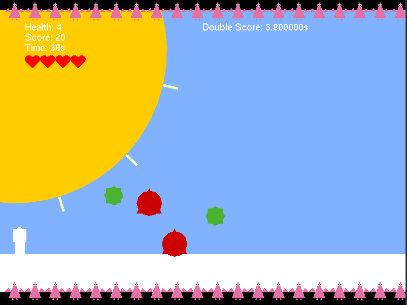

# Endless Runner Game

An endless runner game built using OpenGL, GLUT, and SFML for sound effects. Dodge obstacles, collect power-ups, and survive as long as possible!

 <!-- Add a screenshot if available -->

## Features

- **Player Mechanics**: Jump with 'W/↑', duck with 'S/↓'
- **Obstacles & Collectibles**:
  - Red triangles (obstacles) reduce health
  - Diamonds (collectibles) increase score
  - Green spiked squares grant temporary immunity
  - Purple spiked squares activate double score
- **Dynamic Difficulty**: Speed increases over time
- **Sound Effects**: Background music and sound effects for actions
- **Health System**: 5 health points, visualized with hearts
- **Power-ups**: 
  - Immunity (green): Temporary invincibility
  - Slowdown (purple): Double score multiplier
- **Animated Objects**: Rotating collectibles and moving platforms

## Installation

### Dependencies
- OpenGL
- GLUT
- SFML (for audio)
- C++ Compiler

### Linux (Ubuntu/Debian)
```bash
sudo apt-get install freeglut3-dev libsfml-dev
